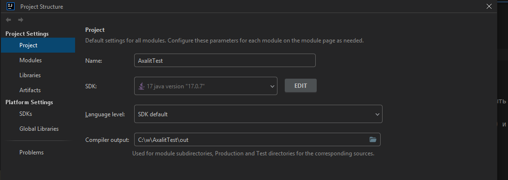

Для фронта используется javafx 17 мавен сам все подкачает
Для анализа используется opencv в враппере от bytedeco(не openpnp!)
// Все зависимости уже присутствуют
// При старте если у вас нет Java 17, то добавляйте свою, если будут проблемы так же можно задать вопрос, 
если какие-то версии не будут работать, можно понизить до 11

Версию java можно скачать при выборе в projectStructure

Запускается класс HelloApplication.main();

Задача 1) состоит в том, чтоб доделать все фронтовые части: все что подписано при запущенном приложении должно быть доделано.
Задача 2) дописать анализ, методы внизу класса Utils (opencv)
Задача 3) нужно провести все значения контролов фронта(слайдеров и тп) до анализа (можно создать отдельный класс) и потом 
результаты выводить на экран на место для картинок

// Желательно сделать все в стиле ооп немного придется переделать классы
// Можно обращаться по вопросам https://t.me/MrVioletFirstOne ответ будет не мгновенный, но будет